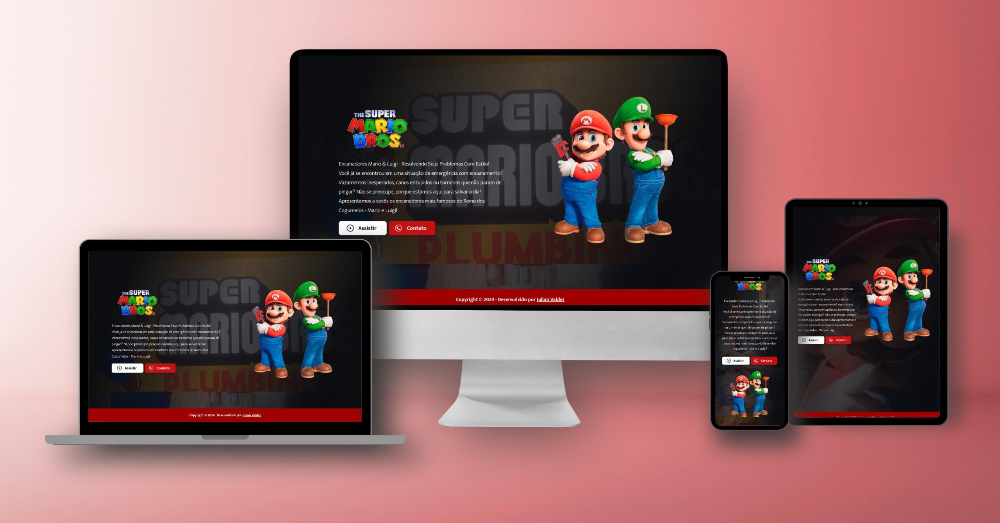

<h1>🍄 Super Mario Bros</h1>
 

Este projeto foi criado no <a href="https://rodolfomori.com.br/devclub/">DevClub.</a>
 
  Trata-se de um formulário com o tema de <b>Super Mario Bros</b>, contendo inputs para nome, telefone e texto.
   
  O projeto foi desenvolvido com o objetivo de ensinar e exercitar os conceitos de HTML, CSS e JavaScript 
  durante as aulas ao vivo que aconteceram no evento <b>"Programador em 72h"</b> do Dev Club.
   
  A página de destino foi cuidadosamente desenvolvida para se adaptar de maneira intuitiva a uma ampla gama de telas, 
  tanto para desktop, quanto de dispositivos móveis.

 
<h2>• Tecnologias utilizadas:</h2>
 

 
<h3>• Mockup do projeto:</h3>

 
